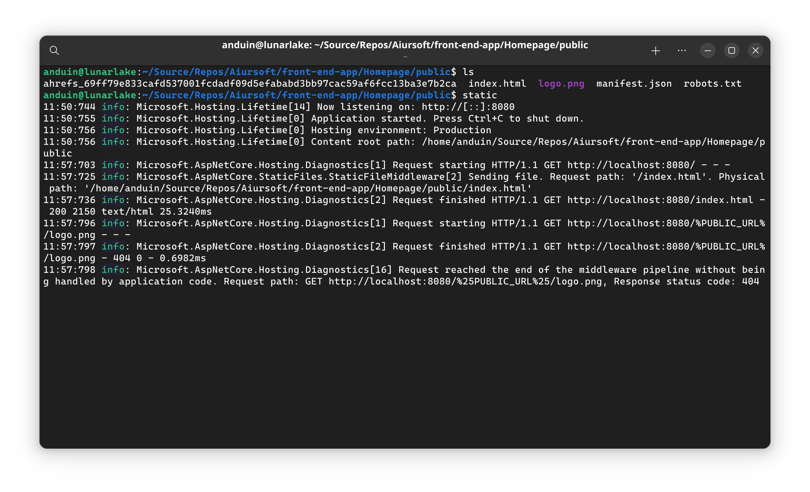

# Aiursoft.Static

[](https://gitlab.aiursoft.com/aiursoft/static/-/blob/master/LICENSE)
[](https://gitlab.aiursoft.com/aiursoft/static/-/pipelines)
[](https://gitlab.aiursoft.com/aiursoft/static/-/pipelines)
[](https://www.nuget.org/packages/Aiursoft.Static/)
[](https://manhours.aiursoft.com/r/gitlab.aiursoft.com/aiursoft/Static.html)
[](https://hub.docker.com/r/aiursoft/static)

Static is a simple static files HTTP server, as a global tool.



## Install

Requirements:

1. [.NET 10 SDK](http://dot.net/)

Run the following command to install this tool:

```bash
dotnet tool install --global Aiursoft.Static
```

## Usage

After getting the binary, run it directly in the terminal.

```bash
$ static.exe  --help
Description:
  Start a static file server.

Usage:
  static [options]

Options:
  -p, --port <port>                  The port to listen for the server. [default: 8080]
  --path <path>                      The folder to start the server. [default: .]
  --allow-directory-browsing         Allow directory browsing the server files under the path. This options if conflict with --mirror. [default: False]
  --mirror <mirror>                  The website to mirror. Automatically proxy the file if the file is not found in the server. This option if conflict with 
                                     --allow-directory-browsing. []
  --cache-mirror                     Cache the mirrored files. This will save the mirrored files to the server's disk. [default: False]
  --enable-webdav                    Enable WebDAV for the server. This is a read-only WebDAV server. [default: False]
  --enable-webdav-write              Enable write access for the WebDAV server. This will allow the client to write files to the server. However, this requires the server 
                                     process to run with write permission. [default: False]
  --not-found-page <not-found-page>  Specifies a custom 404 page to be served when a requested file is not found. This file should reside in the server's root folder. If 
                                     this option is left blank or not set, a default 404 response will be returned. []
  --version                          Show version information
  -?, -h, --help                     Show help and usage information

It will start an HTTP server on http://localhost:8080.
```

## Install for all users

You can install this tool for all users by running the following command:

```bash
sudo apt install -y dotnet9
sudo dotnet tool install Aiursoft.Static --tool-path /opt/static || sudo dotnet tool update Aiursoft.Static --tool-path /opt/static
sudo chmod +x /opt/static/static
```

Then you can run the tool by `/opt/static/static`.

## Install for systemd

You can make it a systemd service by creating a file `/etc/systemd/system/static.service` with the following content:

```ini
[Unit]
Description=Serves static files for '/mnt/data' on port 48466
After=network.target
Wants=network.target

# Before starting, run:
# find /mnt/data -type d -print0 | sudo xargs -0 chmod 0755
# find /mnt/data -type f -print0 | sudo xargs -0 chmod 0644
# So www-data user can read the files
# Also owner user can write to the files
[Service]
User=www-data
Type=simple
Restart=on-failure
RestartSec=5s
ExecStart=/opt/static/static --path /mnt/data -p 48466 --allow-directory-browsing
WorkingDirectory=/mnt/data
LimitNOFILE=1048576
KillSignal=SIGINT
Environment="ASPNETCORE_ENVIRONMENT=Production"
Environment="DOTNET_PRINT_TELEMETRY_MESSAGE=false"
Environment="DOTNET_CLI_TELEMETRY_OPTOUT=1"
Environment="ASPNETCORE_FORWARDEDHEADERS_ENABLED=true"

[Install]
WantedBy=multi-user.target
```

Then you can start the service by running:

```bash
sudo systemctl enable static
sudo systemctl start static
sudo systemctl status static
```

## Run in Docker

First, install Docker [here](https://docs.docker.com/get-docker/).

Then run the following commands in a Linux shell:

```bash
image=aiursoft/static
appName=static
sudo docker pull $image
sudo docker run -d --name $appName --restart unless-stopped -p 5000:5000 -v /var/www/$appName:/data $image
```

That will start a web server at `http://localhost:5000` and you can test the app.

The docker image has the following context:

| Properties  | Value                                  |
|-------------|----------------------------------------|
| Image       | aiursoft/static                        |
| Ports       | 5000                                   |
| Binary path | /app                                   |
| Data path   | /data                                  |

## Use Aiursoft.Static to build your own Docker image

You can use Aiursoft.Static to build your own Docker image. Here is an example of a `Dockerfile`:

Assuming that you have a React project in the current directory that can be built with `yarn build` and the output is in the `build` directory.

```Dockerfile
# ============================
# Prepare Build Environment
FROM node:21-alpine as npm-env
WORKDIR /src
COPY . .
RUN yarn
RUN yarn build

# ============================
# Prepare Runtime Environment
FROM aiursoft/static
COPY --from=npm-env /src/build /data
```

If you want to override the default behavior, simply add the `entrypoint` key to the service.

```Dockerfile
FROM aiursoft/static
COPY --from=npm-env /app/public /data

ENTRYPOINT [ "/app/static", "--port", "5000", "--path", "/data", "--not-found-page", "/404.html" ]
```

## Use Aiursoft.Static in docker-compose

You can use Aiursoft.Static in docker-compose. Here is an example of a `docker-compose.yml`:

```yaml
version: '3.7'

services:
  static:
    image: aiursoft/static
    volumes:
      - your-volume:/data
```

If you want to override the default behavior, simply add the `entrypoint` key to the service.

```yaml
version: '3.7'

services:
  static:
    image: aiursoft/static
    volumes:
      - your-volume:/data
    entrypoint: ["sh", "-c", "/app/static --port 5000 --path /data/mirror/archive.ubuntu.com --allow-directory-browsing"]
```

## How to contribute

There are many ways to contribute to the project: logging bugs, submitting pull requests, reporting issues, and creating suggestions.

Even if you with push rights on the repository, you should create a personal fork and create feature branches there when you need them. This keeps the main repository clean and your workflow cruft out of sight.

We're also interested in your feedback on the future of this project. You can submit a suggestion or feature request through the issue tracker. To make this process more effective, we're asking that these include more information to help define them more clearly.
